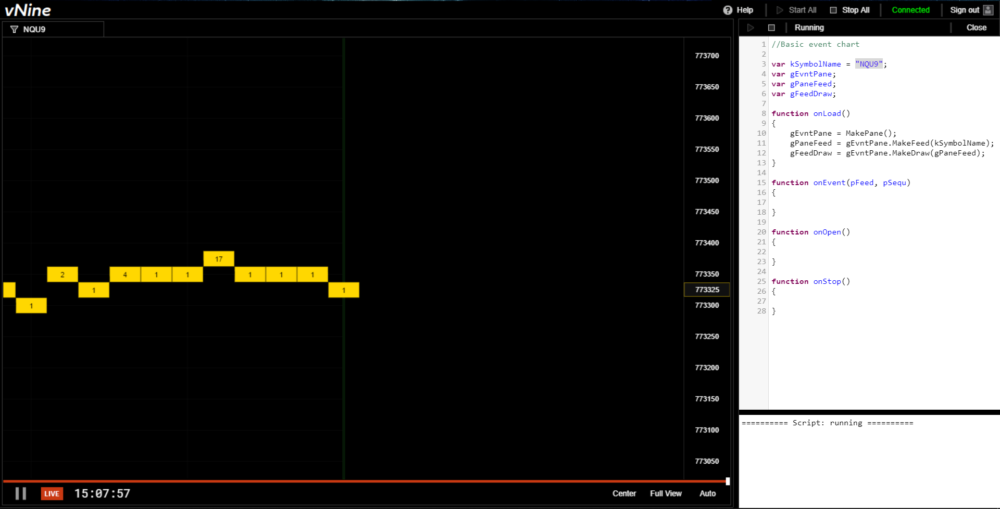
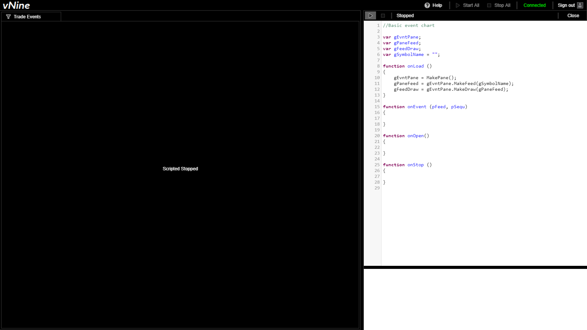

# API Manual

v9 is an analytical product for tracking past and current futures contracts. It allows you to programmatically perform actions based on 
incoming CME WebSocket event data with nanosecond precision.

## Accessing v9

Go to [v9.vertex-analytics.com](https://v9.vertex-analytics.com) to access the latest build of v9. 

## User Interface

v9's user interface is broken up into two primary sections:
- v9's Editor
- v9's Dashboards

### v9 Editor

The v9 Editor is where programmers can write custom Javascript-based scripts to build out individual data visualization solutions.

Each script corresponds to a data visualization solution.

### v9 Dashboard

v9's Dashboards are composed of either one or multiple scripts written in the v9 Editor, and they can easily be exported and shared with other users. 

v9 Dashboards are where traders/portfolio managers monitor contracts using the charts built out in the v9 Editor section.


<!-- ### Opening the editor -->

Click the JS button to open up the Javascript style editor. 
You should be presented with a default, empty sample script corresponding to your new pane.  

It may seem daunting at first glance, but soon you'll come to find that nearly 
everything in this sample script is crucial for contructing your own.


[//]: # "Replace this image when 'scripted stopped' is fixed"

<!-- ### Testing a script -->

Once in the editor, it's easy to run the default script by simply choosing a symbol and clicking the 
start button.  

You should see a series of [Events](../class/src/index.js~Event.html) fill the 
[Pane](../class/src/index.js~CEvntPane), and notice that the start button has been greyed out. 



At this point, you can click the stop button to stop the default script and get to work on your own.

For certain periods throughout the day, EVNTScript will not be able to generate charts. 
This is because the vNine platform makes use of the time in which the exchange is down to process and archive data. 
Below is a chart containing weekly hours of downtime.

| Monday        | Tuesday       | Wednesday     | Thursday      | Friday  | Saturday   | Sunday  |
|---------------|---------------|---------------|---------------|---------|:----------:|---------|
| 4:00pm-5:00pm | 4:00pm-5:00pm | 4:00pm-5:00pm | 4:00pm-5:00pm | 4:00pm- | -          | -5:00pm |

Also, please note that some contracts also stop the exchange from 3:15pm-3:30pm on weekdays.

## Declaring your Variables

Once you've opened your Javascript editor, you should see your main CEVNTPane and 
CEVNTFeed variables. These are foundational objects you're going to use most to 
maintain the feed of the symbol you're tracking.

```js
var gSymbolName = "";
var gEvntPane;
var gPaneFeed;
var gFeedDraw;
```

- [CEvntPane](../class/src/index.js~CEvntPane) ```gEvntPane```  
Your pane variable allows you to create just about everything else we're going to need 
to make use of your script.

[//]: # "Test whether or not this reference syntax works"

- [CEvntFeed](../class/src/index.js~CEvntFeed.html) ```gPaneFeed```  
Your feed variable will be used to track and make use of every single [Event](../class/src/index.js~Event.html) 
that has occured since the exchange last opened.

- [CEvntDraw](../class/src/index.js~CEvntDraw.html) ```gEvntDraw```  
Your draw variable will let you draw the feed you're tracking to your pane. This is useful 
for determining for yourself whether or not your script is properly handling the data it is 
receiving from your symbol.

- [String](https://developer.mozilla.org/en-US/docs/Web/JavaScript/Reference/Global_Objects/String) ```kSymbolName```  
The symbol name is the technical name of the symbol we want to interpret.

[//]: # "[symbols](link to symbol names)"

### Built-in Functions

#### [onLoad](../function/index.html#static-function-onLoad)

The built in onLoad function is called when the user clicks the run button shown below.  



It is extremely useful for setting up all of your variables perfectly before your script 
begins running through each and every event in the [onEvent](../function/index.html#static-function-onEvent) method.

[//]: # "Test whether or not this reference syntax works"

```js
function onLoad ()
{
    gEvntPane = MakePane();
    gPaneFeed = gEvntPane.MakeFeed(gSymbolName);
    gFeedDraw = gEvntPane.MakeDraw(gPaneFeed);	
}
```

- [MakePane](../function/index.html#static-function-MakePane) ```MakePane()```  
The built in function [MakePane](../function/index.html#static-function-MakePane) 
returns a new [CEvntPane](../class/src/index.js~CEvntPane.html) object. 
Most of the time, the above snippet included, it is used to set your ```gEvntPane``` variable 
to a new pane in the initialization of your script.

- [MakeFeed](../class/src/index.js~CEvntPane.html#instance-method-MakeFeed) ```gEvntPane.MakeFeed(gSymbolName)```  
Returns a new [CEvntFeed](../class/src/index.js~CEvntFeed.html) object 
based on your specified symbol name. If you pass in the same symbol name, this is equivilent to 
the feed that will be tracked in your 
[onEvent](../function/index.html#static-function-onEvent) method.

- [MakeDraw](../class/src/index.js~CEvntPane.html#instance-method-MakeDraw) ```gEvntPane.MakeDraw(gPaneFeed)```  
Returns a new [CEvntDraw](../class/src/index.js~CEvntDraw.html) object 
based on your newly created feed. This will render your feed in your pane.

#### [onEvent](../function/index.html#static-function-onEvent)

The built in onEvent function is called once for each timestamp tracked in your symbol.  

This is where you'll be doing most of your calculations on the specific things you're 
looking for in your symbol. It allows your script to perform different tasks depending 
on the current event's conditions.

```js
function onEvent (pFeed, pSequ)
{
	
}
```

- [CEvntFeed](../class/src/index.js~CEvntFeed.html) ```pFeed```  
A feed with timestamps measured in nanoseconds with 64 bit precision.

- [Number](https://developer.mozilla.org/en-US/docs/Web/JavaScript/Reference/Global_Objects/Number) ```pSequ```  
A number that is used for Amount of events within this sequence. It defaults to 0.

#### [onOpen](../function/index.html#static-function-onOpen)

The built in onOpen function is called once the pane has properly loaded and rendered the Symbol information.

It allows you to make any last minute changes once your script has successfully tracked each and every 
event in your symbol's feed.

```js
function onOpen ()
{
	
}
```

#### [onStop](../function/index.html#static-function-onStop)

The built in onStop function is called when the user clicks the stop button shown below.


This function can be useful for logging data gathered while the symbol was running.

```js
function onStop ()
{
	
}
```

## General Formatting

### Notation

Constants used for distinguishing variable roles

- `k` | K denotes a constant variable
- `g` | G denotes a global variable

```js
var gEvntPane;
var gPaneFeed;
var kSymbolName = "ESM9";
```

## Enumerated Constants

### [CEvntFeed.FeedStep](../class/src/index.js~CEvntFeed.html#instance-method-FeedStep)

Constants used for CEvntFeed.FeedStep

- `kStepShow` | Shows the event aggregating by time
- `kStepHide` | Withholds the event from the Symbol viewport
- `kStepHalt` | Shows the previous event
- `kStepNext` | Advances the step position

```js
gPaneFeed.FeedStep = kStepHide; //This will hide the current event in the feed
```

### [kEvent.Type](../class/src/index.js~Event.html#instance-member-Type)

Enumerated types of events

- `kEvent.Type.Trade`
- `kEvent.Type.Bid`
- `kEvent.Type.Ask`
- `kEvent.Type.ImpliedBid`
- `kEvent.Type.ImpliedAsk`
- `kEvent.Type.BookReset`

```js
if (tTick.Type == kEvent.Type.Trade)
{
	//Do something based on event being a trade
}
```

### [kEvent.Trade.Aggressor](../class/src/index.js~Trade.html#instance-member-Aggressor)

Enumerated values for getting the type of aggressor of a trade event

- `kEvent.Trade.Aggressor.Buy`
- `kEvent.Trade.Aggressor.Sell`

```js
if (tTick.Type == kEvent.Type.Trade)
{
	if (tTick.Trade.Aggressor == kEvent.Trade.Aggressor.Buy)
	{
		//Do something based on trade's aggressor being a buyer
	}
}
```

### [kEvent.Bid.Type](../class/src/index.js~Bid.html#instance-member-Type)

Enumerated values for getting the type of a bid event

- `kEvent.Bid.Type.New`
- `kEvent.Bid.Type.Change`
- `kEvent.Bid.Type.Delete`
- `kEvent.Bid.Type.DeleteThru`
- `kEvent.Bid.Type.DeleteFrom`
- `kEvent.Bid.Type.Overlay`
- `kEvent.Bid.Type.Replace`

```js
if (tTick.Bid.Type == kEvent.Bid.Type.New)
{
	//Do something based on bid's type being new
}
```

### [kEvent.Ask.Type](../class/src/index.js~Ask.html#instance-member-Type)

Enumerated values for getting the type of an ask event

- `kEvent.Ask.Type.New`
- `kEvent.Ask.Type.Change`
- `kEvent.Ask.Type.Delete`
- `kEvent.Ask.Type.DeleteThru`
- `kEvent.Ask.Type.DeleteFrom`

```js
if (tTick.Ask.Type == kEvent.Ask.Type.New)
{
	//Do something based on ask's type being new
}
```

### [CEvntPane.Wave](../class/src/index.js~CEvntPane.html#instance-method-PlayWave)

Enumerated values for playing different audio files

- `Bang` | 0
- `Clang` | 1
- `Punch` | 2
- `Ring_1` | 3
- `Ring_2` | 4
- `Ring_3` | 5
- `Ring_4` | 6
- `Ring_5` | 7
- `Ring_6` | 8
- `Ring_7` | 9
- `Slap` | 10

```js
CEvntPane.PlayWave(0); //Plays a bang!
```

