# API Manual

v9 is an analytical product for tracking past and current futures contracts. It allows you to programmatically perform actions based on
incoming CME WebSocket event data with nanosecond precision and same-day transaction settlement (T-0).

## Accessing v9

The latest build of v9 may be accessed at [v9.vertex-analytics.com](https://v9.vertex-analytics.com).

## v9 Editor

The v9 Editor is where programmers can write custom algorithms in order to build out individual data visualization solutions.

Each algorithm's script, located on the lefthand side, corresponds to a data visualization solution located on the righthand side.

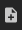

Initially, you must click the "new script" button, shown above, in order to access all
of the different sections of the v9 Editor.

### Sections

#### Top-bar

The top-bar houses four navigation buttons to the right that each take you to different pages of v9.

|                                          | Top-bar Buttons                   |
| ---------------------------------------- | --------------------------------- |
| 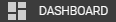   | Navigates to the v9 Dashboard     |
|  | Navigates to the v9 Data Center   |
|         | Navigates to the v9 Documentation |
| 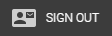    | Navigates to the v9 Log In Page   |

#### Left-bar

The bar on the left-hand side of the v9 Editor contains options for showing and hiding
different sections of v9.

|                                                  | Left-bar Top Buttons           |
| ------------------------------------------------ | ------------------------------ |
|     | Shows / hides the Explorer     |
|  | Shows / hides the Text Editor  |
|         | Shows / hides the Pane         |
| 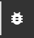       | Shows / hides the Debug Output |

|                                                | Left-bar Bottom Buttons                     |
| ---------------------------------------------- | ------------------------------------------- |
| 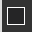       | Changes the v9 Editor to a dark theme       |
| 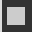      | Changes the Text Editor to a light theme    |
| 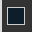  | Changes the v9 Editor to a dark blue theme  |
|  | Changes the v9 Editor to a light blue theme |

#### Explorer

The explorer houses all of the user's scripts and Vertex Analytics sample scripts.

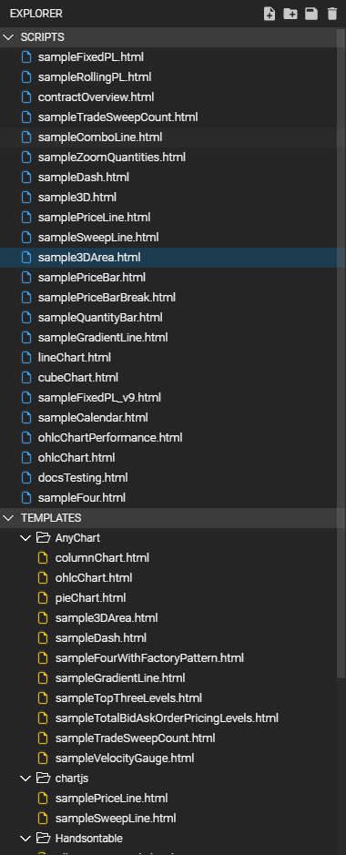

- Top buttons

These buttons correspond to different actions that may be performed on files
within the explorer.

|                                           | Top Explorer Buttons                              |
| ----------------------------------------- | ------------------------------------------------- |
|     | Adds a new base script                            |
|  | Opens a window that allows for importing a script |
| 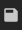   | Downloads the current script                      |
| 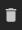 | Deletes the current script                        |

- Your scripts


The scripts dropdown, pictured above, houses each and every one of the user's scripts.

- Templates


The templates dropdown, pictured above, houses sample scripts created by Vertex Analytics staff separated by library.

#### Text Editor

This section represents the area to the right of the explorer section where users create and edit HTML files that contains algorithms to visualize different symbol data.


#### Debugging Output

This section represents the area below the text editor where syntax and runtime errors are logged regarding current the script(s).

- Chrome's built-in console will handle issues with external libraries.

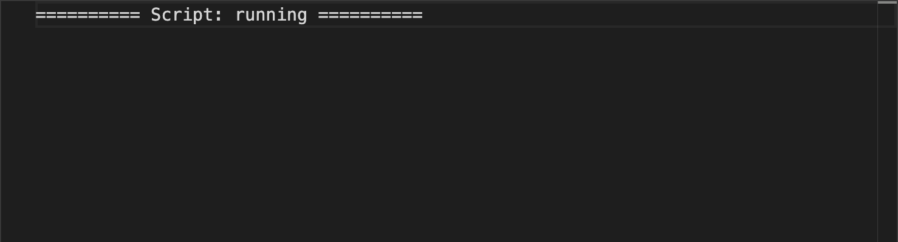

#### Pane

The pane section, to the right of the text editor, is where the current script is visualized when run.
The user may choose to specify the symbol and date values that the current script should reference here or within their script.

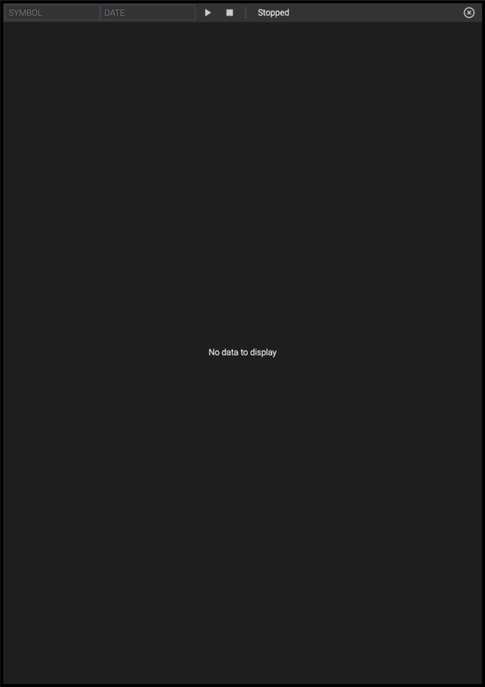

#### File Architecture

As part of the file architecture, there are four main parts that make up each file:

- Library Importations

  - This section refers to the top of the HTML file where both v9's propritary library and third-party libraries are imported.

    - Every script imports the v9 backend via `<script src="https://v9.vertex-analytics.com/_vxaapi-1.0.0/v9.js"></script>`

- JavaScript Section

  ```
    <script>
      class CustomFeed extends v9.feed {
        onOpen(pMeta){}
        onLoad(){}
        onRender(){}
        onEvent(pSymbol, pEvent, pRealTime){}
        onStop(){}
      }

      let feed = new CustomFeed();
    </script>
  ```

  - This section refers to all of the data visualization logic that is executed within v9's runtime. This includes the class declaration for the v9 event feed, the lifecycle methods associated with a v9 feed, and the instantiation of a v9 feed object after defining all of the data visualization logic within the class body.

    There are five lifecycle methods associated with each v9 feed. Each lifecycle method executes at a different point in time while the current script is running.

    - [onOpen(](../class/src/index.js~feed.html#instance-method-onOpen)[pMeta](../typedef/index.html#static-typedef-Meta)[)](../class/src/index.js~feed.html#instance-method-onOpen)

      ```
      onOpen(pMeta) {

      }
      ```

      - This is the first method that is called when a script is run as soon as the current script's custom [feed](../class/src/index.js~feed.html) object (`class CustomFeed extends v9.feed`) is instantiated. It only runs once.

      - Parameters

        - [pMeta](): Contains metadata associated with each symbol ran within the v9 runtime.

    - [onLoad()](../class/src/index.js~feed.html#instance-method-onLoad)

      ```
      onLoad() {

      }
      ```

      - This method is called when an object from the `class CustomFeed extends v9.feed` is instantiated and the pane has initally loaded all previous events and information from the current symbol.

    - [onRender()](../class/src/index.js~feed.html#instance-method-onRender)

      ```
      onRender() {

      }
      ```

      - This method is called, at most, 60 times per second once onLoad completes.

    - [onEvent()](../class/src/index.js~feed.html#instance-method-onEvent)

      ```
      onEvent(pSymbol, pEvent, pRealTime) {

      }
      ```

      - This method is called once for every incoming event in relation to the current symbol.

      <!-- - For feeds with multiple contracts, see pMeta in the onOpen() lifecycle method above. \*\*\* this isn't a feature yet -->

      - Parameters

        - pSymbol: Name of the current symbol.

        - [pEvent](../class/src/index.js~Event.html): Current event being handled.

        - pRealTime: Boolean determining whether or not to only handle current events.

    - [onStop()](../class/src/index.js~feed.html#instance-method-onStop)

      ```
      onStop() {

      }
      ```

      - This method is called when the script is stopped by the user.

- CSS Section

  ```
  <style>
    html, body, #container {
      width: 100%;
      height: 100%;
      margin: 0;
      padding: 0;
    }
  </style>
  ```

  - This section refers to styling overrides the user makes within their script(s).

- HTML Section

  ```
  <body>
    <div id="container"></div>
  </body>
  ```

  - This section will always contain a div. By default, its ID is "container". The script's feed will point to this HTML element's ID by default.

    - The proper method to reference this HTML element's ID will be different depending on the library being used.

## v9 Dashboard

v9's Dashboards are composed of either one or multiple scripts written in the v9 Editor.

<!-- , and they can easily be exported and shared with other users. -->

v9 Dashboards are where traders monitor contracts using the charts built out in the v9 Editor section.

### Dashboard Sections

#### Explorer Section
